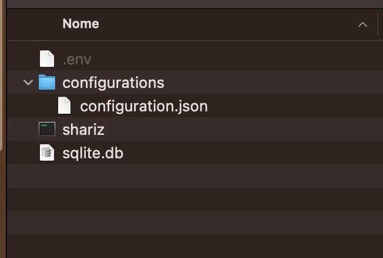
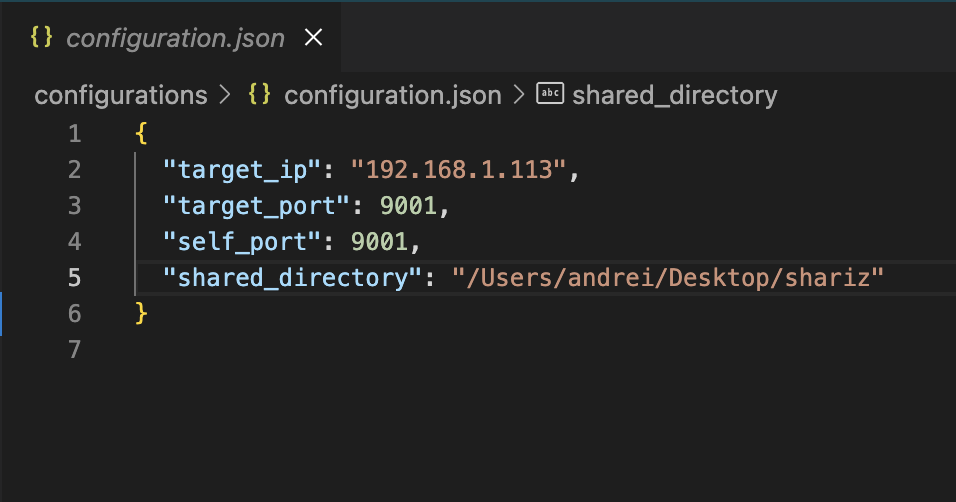
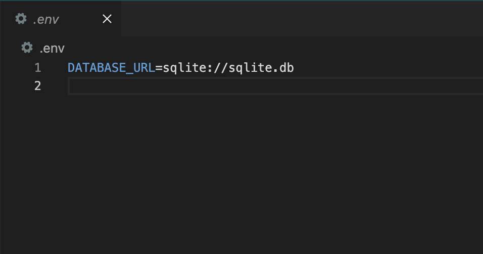
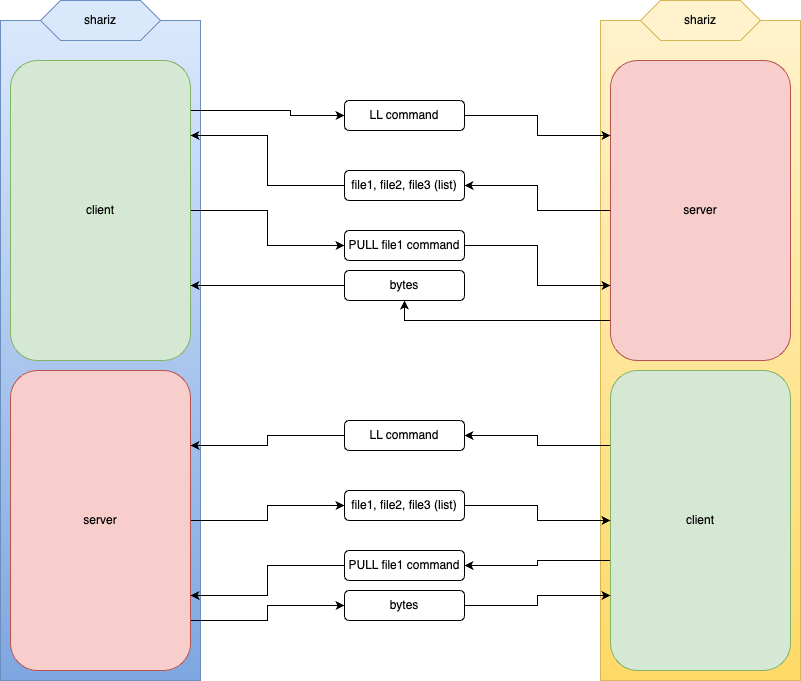
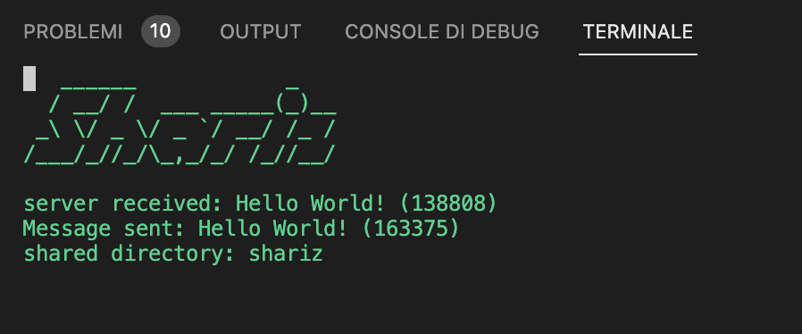

```
   ______            _   
  / __/ /  ___ _____(_)__
 _\ \/ _ \/ _ `/ __/ /_ /
/___/_//_/\_,_/_/ /_//__/
                         
```

# What is Shariz?
Shariz, like dropbox, is a file sharing application. Shariz was implemented in Rust. For now it allows to share files between 2 computers.

# How to configure and run the standalone?



 First of all download the latest executable compatible with your OS (Windows, MacOS, Linux) from [here](https://github.com/goto-eof/shariz/releases). Then create the `.env` file and the `configuration.json` file like was done in the previous screenshot (do not generate the `sqlite.db` file). Edit the `configuration.json` as described in the next paragraph. Run shariz from command line `./shariz` (if you are using a Mac, allow execution of unidentified developers, otherwise you will not be able to run the executable). Do the same for the second PC. 





On the first PC replace the `target_ip` with the others PC connected on the same network. Update also the `shared_directory` property that should point to the directory that will be shared. Do the same on other PC. Add/remove some file from the shared directory of the first PC and magically you will see that the same operation is done also in the shared directory of the second PC.

Of course you can run shariz at system startup, so that it can work in background (for example, for Linux some info could be found [here](https://www.baeldung.com/linux/run-script-on-startup)).

# How it works?
At startup Shariz loads the target server ip and port from the configuration file and creates a client that will connect to the target server. Meanwhile it makes a connection with the target application, requests for files and downloads them.



# Screenshot



# Development stack


# For developers
```
sudo apt-get install libsqlite3-dev
```

If you want to report a bug, please write here [here](http://andre-i.eu/#contactme).
cargo install diesel_cli --no-default-features --features sqlite
```
diesel migration run
```


# Tests

I tested the application on a Mac and a Linux computer and it works fine (perhaps there are some bugs that I should fix).


If you fount some bugs please report them [here](http://andre-i.eu/#contactme).
