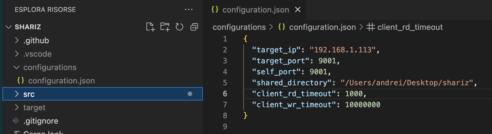

```
   ______            _   
  / __/ /  ___ _____(_)__
 _\ \/ _ \/ _ `/ __/ /_ /
/___/_//_/\_,_/_/ /_//__/
                         
```
# Shariz is a Work In Progress project

# What is Shariz?
Shariz, like dropbox, is a file sharing application. Shariz was implemented in Rust. For now it allows to share files between 2 computers.

# How it works?
At startup Shariz loads the target server ip and port from the configuration file and creates a client that will connect to the target server. Meanwhile it makes a connection with the target application, requests for files and downloads them.


# How to configure it?



On the first PC replace the `target_ip` with the others PC connected on the same network. Update also the `shared_directory` property that should point to the directory that will be shared. Do the same on other PC. Add/remove some file from the shared directory of the first PC and magically you will see that the same operation is done also in the shared directory of the second PC.

# Screenshot


# How will be the final project?
If I'll have time, in the final project every client should first try to connect to a known server and should retrieve a list of IPs of other Shariz servers. Then the client will request files for every server of the downloaded list. 

# For developers
```
sudo apt-get install libsqlite3-dev
```